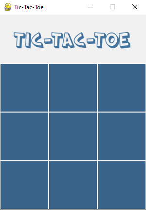

# Tic Tac Toe with AI
This is Tic-Tac-Toe Game created with Python and used PyGame for the UI. This is our semestral project for my AI course. The goal is to never let the user win, result will always be "LOSE" or "DRAW". It uses Min Max Algorithm for its AI.

